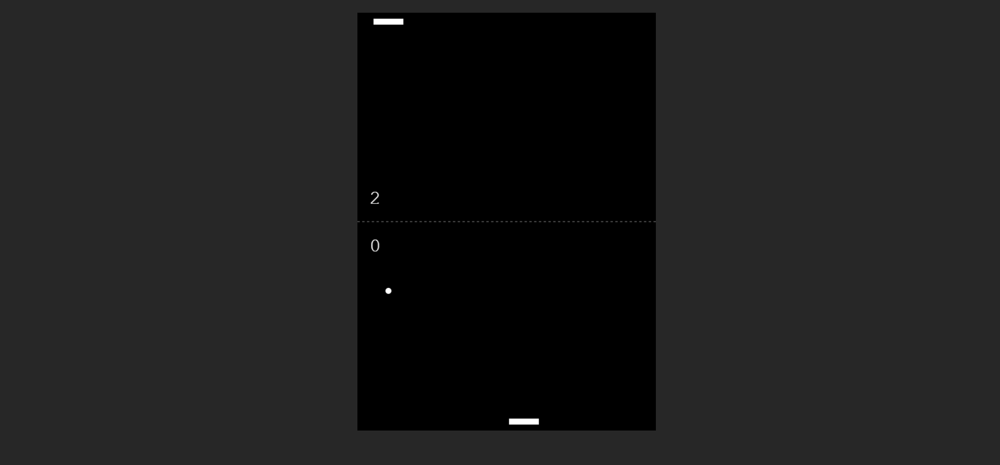

# 🕹️ Pong Game

Bine ați venit la proiectul nostru Pong Game! Acesta este un joc clasic Pong, construit utilizând HTML5 Canvas și JavaScript.

## 🚀 Descriere
Acest proiect este o implementare simplă a jocului Pong, în care utilizatorul joacă împotriva calculatorului. Scopul jocului este de a atinge primul un scor de 7 puncte pentru a câștiga.

## 🛠️ Tehnologii Folosite
- HTML5
- CSS3
- JavaScript

## 📋 Funcționalități
- Control prin mouse pentru jucător
- Inteligenta artificială pentru adversarul controlat de calculator
- Detectarea coliziunilor și actualizarea vitezei bilei
- Afișarea scorului și a mesajului de sfârșit de joc
## 🏁 Începe să joci
Have fun playing! 🎮
